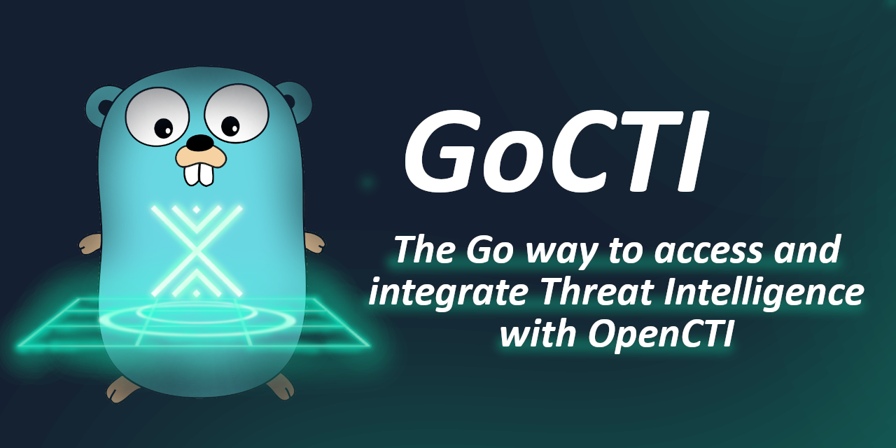

<p align="center">
    <picture>
      
    </picture>
</p>

# GoCTI

Unofficial [OpenCTI](https://github.com/OpenCTI-Platform/opencti) Go client. GoCTI is under development, hence breaking changes are to be expected until a version 1.0.0 is released.

GoCTI is currently compatible with OpenCTI version 6.7.12.

Like with [pycti](https://github.com/OpenCTI-Platform/client-python), the OpenCTI platform version supported by GoCTI should exactly match the version of your OpenCTI instance.
No guarantees can be made with regards to back and forwards compatibility.

Feedback and suggestions are welcome through Github issues.

## Quick Start

```bash
go get github.com/weisshorn-cyd/gocti
```

### Create a new Client

```go
// The client supports additional options: See api/options.go
client, err := gocti.NewOpenCTIAPIClient(
	"http://localhost:8080",
	"my_secret_token",
    gocti.WithHealthCheck(),
)
```

### Interact with Platform Data

The client holds a basic `Query` method to make any GraphQl query to OpenCTI:

```go
func (client *OpenCTIAPIClient) Query(
	ctx context.Context,
	query string,
	variables any,
) (map[string]any, error)
```

Entities have their own methods for creation, deletion, listing, and reading. These return a (list of) structs representing the target entity.
These are also methods held by the client.
For example, to create a malware entity:

```go
malware, err := client.CreateMalware(ctx, "", entity.MalwareAddInput{
	Name:        "Example Malware",
	Description: "An example of a very malicious malware.",
})
```

Each method has a `customAttributes` field which specifies which GraphQL attributes the underlying query should return.
For methods that return specific Go types (e.g. the `CreateMalware` method above), this indicates which fields of the return value will be set. If the empty string is provided as value for `customAttributes`, then the default attributes will be set for these methods. These are defined for each type.

List methods have a boolean parameter `getAll`. If set to `true`, the method will return everything in the platform that matches the underlying query. In case the query returns large amounts of data, it is recommended to set it to `false` and use the paginated list approach instead.

Generic and structured methods to list, read, create, and delete data are available through the `api` package. These methods can be used on the fly to add functionality to GoCTI that is missing for your specific use case.

### Entities

The entities that are implemented can be found under the [entity](./entity) folder. They more or less match what is available via [pycti](https://github.com/OpenCTI-Platform/client-python).

### System Management

Additional entities have been implemented for platform management. Some of them have special methods attached to perform specific tasks (see [system/utils.go](system/utils.go)).

## Examples

Examples are provided in the [examples](./examples/) folder:

- `entity_creation` shows what is considered as common usage of GoCTI
- `list_report_ips` highlights current limitations and how to circumvent them by customizing GoCTI on the fly
- `system_management` is an example of GoCTI's system management capabilities
- `pagination` shows how to list data with pagination
- `custom_struct_parsing` shows how to use custom structs and automated parsing to query exactly what data you need from the server
- `decode_graphql_interface` shows how to convert a field of type GraphQL interface into an implementation and back

## GoCTI design principles

GoCTI code is partially generated using GraphQL introspection.

The aim is to provide the most common functionality out of the box, i.e. the user should not have to write a GraphQL query or know of specific GraphQL types or interfaces for most use cases. There should be no ambiguity as to which fields are supported by a given object.

At the same time, GoCTI can be extended on the fly to cater for more niche or precise usage scenarios.

GoCTI does not directly reason about [STIX](https://www.oasis-open.org/standard/stix-version-2-1/), it only considers the data schema implemented in OpenCTI.

## Development

A [makefile](./Makefile) provides targets useful for development.

### Changelog

Each pull request must update the `[Unreleased]` entry in the [changelog](./CHANGELOG.md).

### Updating supported OpenCTI version

When updating the supported OpenCTI version:
- Update the [docker-compose](./docker-compose.yml) file
- Update the pycti version in [project.toml](./tools/gocti_type_generator/pyproject.toml)
- Update the [changelog](./CHANGELOG.md) with: `- Support OpenCTI version X.Y.Z`
- Update the version in the [readme](./README.md)
- Regenerate the files through `make generate`

### Release a new version of GoCTI

The source of truth for the GoCTI version is the [changelog file](./CHANGELOG.md).

To create a release, open a pull request:
- Change the `[Unreleased]` section in the [changelog](./CHANGELOG.md) into the corresponding version `[X.Y.Z] - YYYY-MM-DD`
- Update the version information in [gocti.go](./gocti.go) and [project.toml](./tools/gocti_type_generator/pyproject.toml) accordingly
- Assign the label `release` to the pull request
- A new release will be created on merge by the [release action](./.github/workflows/create-release.yml)
